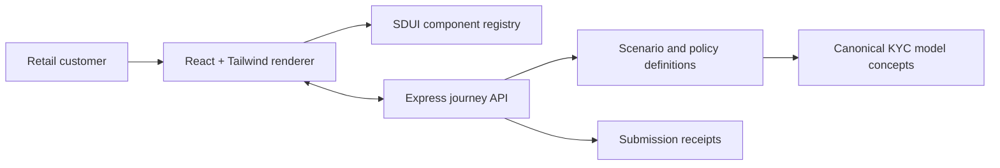

# Retail KYC SDUI demo

A presentation-ready, retail-only customer data review demo built with React, Tailwind CSS and a backend-owned server-driven UI contract.

The frontend contains a registry of reusable UI components. It does **not** contain a page for “passport renewal”, “address conflict” or any other customer scenario. The Express backend selects the journey and returns the screens, copy, options, provenance and component instructions as JSON.

> All customers, documents, addresses and activity in this repository are synthetic. This is an interaction and data-model demonstration, not production compliance software.

## What the demo shows

- 16 synthetic retail customers across action-required, under-review, complete and restricted states.
- 13 reusable SDUI component types including verified fields, evidence upload, declarations, source conflict resolution, party relationships, customer-visible profile data and transaction-profile review.
- Group-wide identity facts separated from booking-entity customer decisions.
- Dynamic multi-screen journeys, backend submissions and next-screen receipts.
- An explicit Reviewer/Customer view switch for presenting both sides of the same journey.
- A live JSON drawer showing the exact payload rendered on screen.
- Backend-defined conditional visibility and required-field validation; selecting “No, I have moved” reveals a structured new-address request.
- A collapsed “Other information we have about you” component on every first screen, allowing customers to inspect data outside the active request.
- Responsive layouts suitable for desktop and mobile demonstrations.

## Run it

Requires Node.js 22 or newer.

```bash
npm install
npm run dev
```

Open <http://localhost:5173>. The command starts:

- Vite on port `5173`.
- The SDUI API on port `8787`.
- A Vite development proxy from `/api` to the backend.

For a production-style local run:

```bash
npm run build
npm start
```

Then open <http://localhost:8787>. Express serves both the API and the generated Vite assets.

## Architecture



The important boundary is between the renderer and the journey definition:

| Layer | Owns |
|---|---|
| Backend | Customer scenario, trigger, screen sequence, wording, field instructions, controlled options and next step |
| Frontend | Visual implementation, accessibility, responsive behaviour and component interaction |
| Shared contract | Discriminated TypeScript component schema and API response types |

## Reviewer and customer views

The demo uses one journey but applies a strict role-specific visibility policy:

| Capability | Reviewer | Customer being reviewed |
|---|---:|---:|
| Browse the synthetic customer portfolio | Yes | No |
| See risk, status, trigger and internal tags | Yes | No |
| See “Why this is shown” and the SDUI trace | Yes | No |
| Inspect the raw backend payload | Yes | No |
| Complete the customer review journey | Yes | Yes |
| Expand other customer-visible information on file | Yes | Yes |

Select the customer scenario in Reviewer view, then switch to Customer view to demonstrate exactly what that individual would see. Customer view never displays another customer’s name or the internal risk and decision context.

## API

| Method | Endpoint | Purpose |
|---|---|---|
| `GET` | `/api/health` | Runtime health and scenario count |
| `GET` | `/api/v1/components` | Registered component catalogue and data-model targets |
| `GET` | `/api/v1/customers` | Synthetic portfolio summaries and status totals |
| `GET` | `/api/v1/customers/:id/journey` | Full SDUI journey for one retail customer |
| `POST` | `/api/v1/customers/:id/submissions` | Accept a screen response and return the next screen |
| `POST` | `/api/v1/demo/reset` | Clear in-memory presentation submissions |

An abbreviated journey response looks like this:

```json
{
  "contractVersion": "retail-kyc-sdui/1.0",
  "syntheticData": true,
  "customer": {
    "id": "amira-haddad",
    "bookingEntity": "Northstar Bank AT",
    "scenario": "Conflicting group address",
    "screens": [
      {
        "id": "amira-conflict",
        "title": "Which address is current?",
        "components": [
          {
            "type": "comparison",
            "fieldId": "canonical_address",
            "options": []
          }
        ]
      }
    ]
  }
}
```

## Synthetic scenarios

| Customer | Scenario | Presentation point |
|---|---|---|
| Emma Berger | Clean periodic confirmation | Low-friction completed journey |
| Lukas Weber | Expiring passport | Document replacement and evidence upload |
| Sofia Marin | Recently moved | Triggered address confirmation |
| Amira Haddad | Conflicting group addresses | Explicit assertion resolution without silent overwrite |
| Daniel Novak | Missing tax residency | Country, TIN and tax declaration |
| Helena Vogt | New public function | PEP context and enhanced information |
| Victor Santos | Potential sanctions false positive | Specialist review without unnecessary customer repetition |
| Noah Klein | Minor customer | Guardian authority and acceptance |
| Anna & Max Gruber | Joint account | Multi-party relationship and mandate |
| Elias Petrov | Source of funds | Explanation, amount and evidence |
| Mia Fischer | Changed employment | Event-triggered occupation refresh |
| Oliver Dubois | Transaction-profile mismatch | Observed-versus-expected activity |
| Clara Rossi | Remote verification failure | Safe verification fallback paths |
| Jakob Stein | Full periodic review | Multi-screen review orchestration |
| Lea Horvat | Potential duplicate identity | Controlled group party resolution |
| Karim Aziz | Name transliteration | Multiple scripts, aliases and screening quality |

## Suggested presentation route

1. Start with **Emma Berger** to show the desired low-friction end state.
2. Open **Amira Haddad** and select the newer group address to explain assertion-level provenance.
3. Open the **live payload** drawer to show that the screen came from the backend.
4. Use **Noah Klein** to explain relationships and entity-specific acceptance.
5. Use **Oliver Dubois** to connect customer data collection to ongoing monitoring.
6. Finish with **Clara Rossi** to demonstrate a controlled restricted state and alternative verification methods.

## Relationship to the canonical AML data model

| SDUI concept | Canonical model responsibility |
|---|---|
| Verified field review | `DATA_ASSERTION`, `ATTRIBUTE_RESOLUTION`, Party Master fact |
| Customer correction | New assertion; it does not silently replace verified history |
| Evidence upload | `EVIDENCE_OBJECT`, `ASSERTION_EVIDENCE` |
| Explicit acceptance | `DATA_SUBMISSION`, `AUDIT_EVENT` |
| Joint holder or guardian | `RELATED_PARTY`, `BUSINESS_RELATIONSHIP` |
| Expected activity | `BUSINESS_RELATIONSHIP`, entity-scoped `RISK_RATING` |
| Verification fallback | `IDENTITY_CHECK`, `CDD_REQUIREMENT` |
| Screen sequence | `CDD_CASE`, `CDD_REQUIREMENT`, `DATA_REQUEST` |

The demo deliberately follows the rule: **collect and verify reusable identity facts once, but retain risk, acceptance and restriction decisions for the responsible booking entity and relationship.**

## Add another component

1. Add its discriminated interface to `src/types/sdui.ts`.
2. Add the type to `SduiComponent`.
3. Implement its visual renderer in `src/sdui/renderer.tsx`.
4. Register its model purpose in `server/index.ts`.
5. Use it in a backend journey under `server/data/customers.ts`.
6. Extend the scenario validation test if a new component type was introduced.

## Verification

```bash
npm test
npm run typecheck
npm run build
```

GitHub Actions runs the unit tests and production build for every push and pull request.
